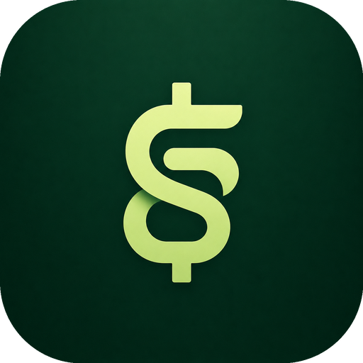
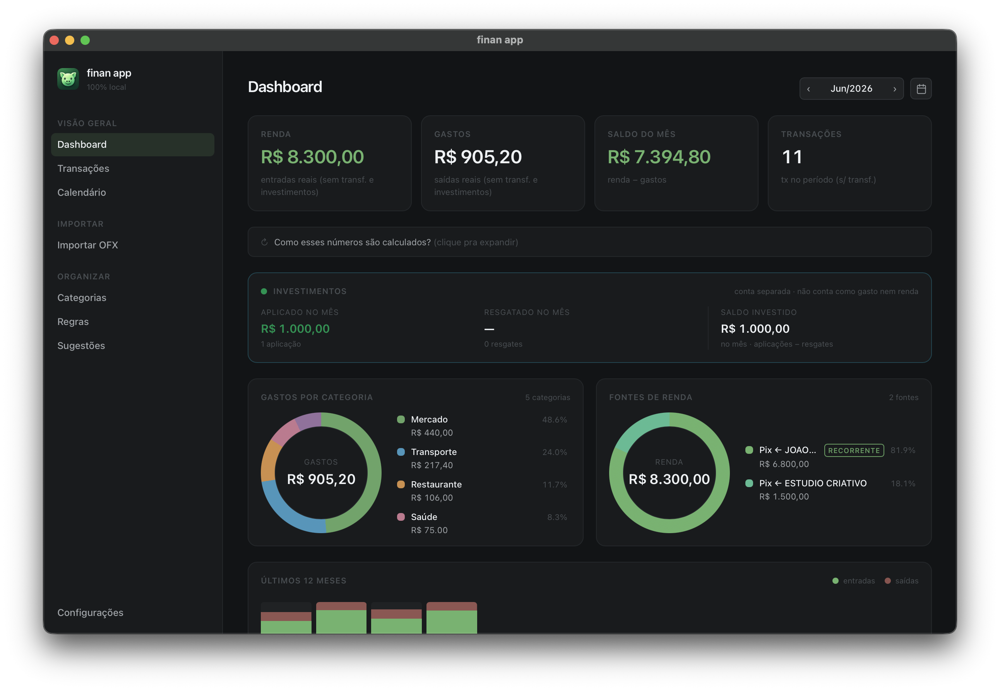
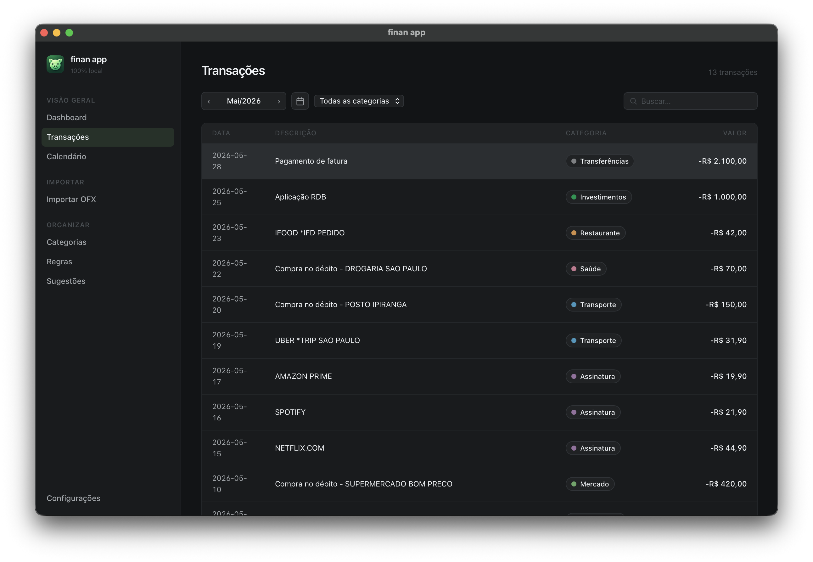
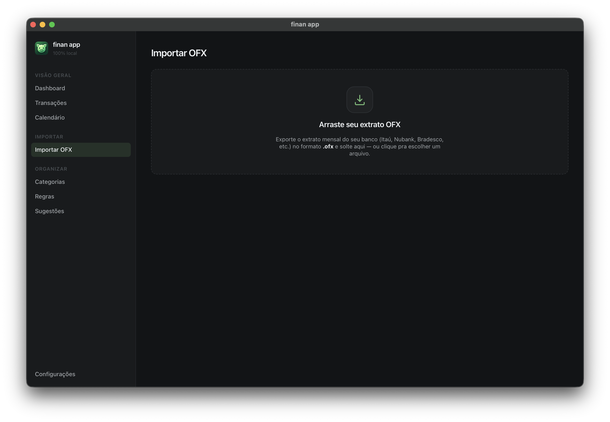
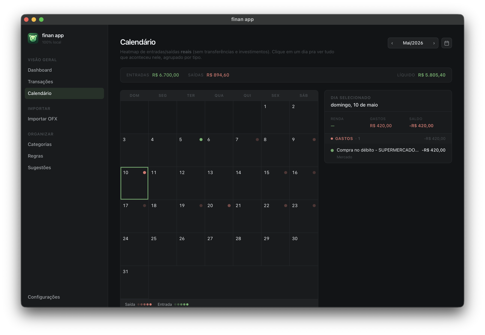

<div align="center">



# finan app

**O dinheiro é seu. Os dados também.**

Finanças pessoais **100% locais** no seu Mac — sem nuvem, sem conta, sem rastreamento.

<br>

<div>
<a href="https://github.com/MateusFonseK/finan-app/releases/latest"></a>


</div>

<br>

<a href="#-instalação">Instalação</a> ·
<a href="#-funcionalidades">Funcionalidades</a> ·
<a href="#-privacidade">Privacidade</a> ·
<a href="#%EF%B8%8F-buildar-do-código">Buildar</a>

</div>

<br>

O **finan app** organiza suas finanças pessoais sem que seus dados saiam do seu computador. Você importa o extrato `.ofx` do banco, ele categoriza com regras, sugere padrões e mostra tudo num painel claro. Tudo fica num único arquivo no seu Mac e nunca vai pra lugar nenhum.

E é **leve**: ~13 MB que baixam num instante, abrem rápido e quase não ocupam espaço no seu Mac.

<br>



<table>
  <tr>
    <td width="33%" valign="top"><p align="center"><sub><b>Transações</b> — categorize e crie regras</sub></p></td>
    <td width="33%" valign="top"><p align="center"><sub><b>Importar</b> — solte o OFX e revise</sub></p></td>
    <td width="33%" valign="top"><p align="center"><sub><b>Calendário</b> — vencimentos e pagamentos</sub></p></td>
  </tr>
</table>

## ✨ Funcionalidades

- 📥 **Importar OFX** — arraste o extrato (ou abra com o finan app) e revise antes de salvar; deduplica transações e detecta estornos automaticamente.
- 🏷️ **Categorias e regras** — categorize manualmente ou crie regras (por trecho da descrição) que se aplicam sozinhas.
- 💡 **Sugestões automáticas** — o app detecta gastos recorrentes sem categoria e sugere regras prontas.
- 📊 **Dashboard** — renda, gastos e saldo do mês, gastos por categoria, fontes de renda (com marcação de recorrentes), investimentos e tendência dos últimos 12 meses.
- 📅 **Calendário** — vencimentos e pagamentos derivados das suas regras.
- 💾 **Backup** — exporte e restaure o seu banco de dados a qualquer momento.
- 🪶 **Leve e rápido** — ~13 MB pra baixar, ~18 MB instalado. Abre num piscar e quase não pesa no seu Mac.
- 🖥️ **Nativo do macOS** — menu nativo, atalhos de teclado, tema claro/escuro, universal (Apple Silicon + Intel).

## 📥 Instalação

1. Baixe o `.dmg` mais recente na aba **[Releases](https://github.com/MateusFonseK/finan-app/releases/latest)**.
2. Abra o `.dmg` e arraste o **finan app** pra pasta **Aplicativos**.
3. **Primeira abertura** — o app **não é assinado** com conta paga da Apple. Como foi baixado da web, na primeira vez o macOS bloqueia com um aviso do tipo *"A Apple não pôde verificar se o 'finan app' está livre de malware…"* (botões **Mover para o Lixo** e **OK** — clique em **OK**, não no lixo).

   **Jeito garantido** — rode no Terminal:
   ```sh
   xattr -dr com.apple.quarantine "/Applications/finan app.app"
   ```
   Depois é só abrir normalmente.

   **Alternativa sem terminal:** **Ajustes do Sistema → Privacidade e Segurança** → seção **Segurança** → **"Abrir Mesmo Assim"**. (O botão só aparece logo após tentar abrir o app.)

> O navegador marca arquivos baixados com uma flag de "quarentena"; sem notarização da Apple, o Gatekeeper pede essa confirmação manual na primeira vez. O código é aberto — você pode auditar e/ou buildar você mesmo.

## 🔒 Privacidade

Não há conta, login, telemetria ou anúncios. Tudo fica em `~/Library/Application Support/app.finan/finan.db`, no seu Mac.

A **única** requisição de rede acontece **durante a importação**: o app consulta a [BrasilAPI](https://brasilapi.com.br) para descobrir o nome de empresas a partir do **CNPJ** que aparece nas transações e sugerir categorias automaticamente. Sai apenas o **número do CNPJ** (informação pública) — nunca valores, descrições nem dados pessoais. Se as transações importadas não tiverem CNPJ, nenhuma requisição é feita.

## 🛠️ Buildar do código

Pré-requisitos: [Rust](https://rustup.rs), [Node 22+](https://nodejs.org) e [pnpm](https://pnpm.io).

```sh
pnpm install

# desenvolvimento
pnpm tauri dev

# build universal (Apple Silicon + Intel)
rustup target add aarch64-apple-darwin x86_64-apple-darwin
pnpm tauri build --target universal-apple-darwin
```

O `.app` e o `.dmg` saem em `src-tauri/target/universal-apple-darwin/release/bundle/`.

## 🧱 Stack

[Tauri 2](https://tauri.app) (Rust) · [Svelte 5](https://svelte.dev) · SQLite (rusqlite). Sem backend, sem telemetria.

## 📄 Licença

[MIT](LICENSE) © 2026 Mateus Fonseca

<div align="center">
<br>
<sub>Feito com cuidado. 🌱</sub>
</div>
