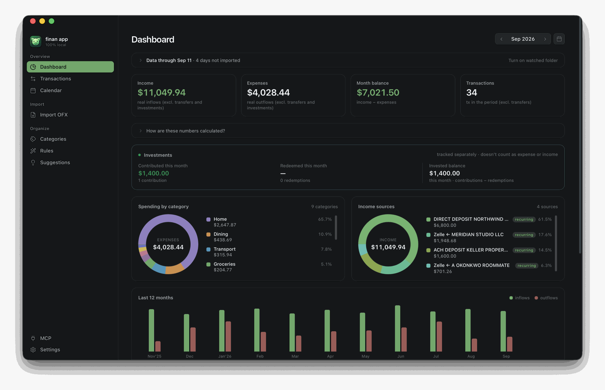
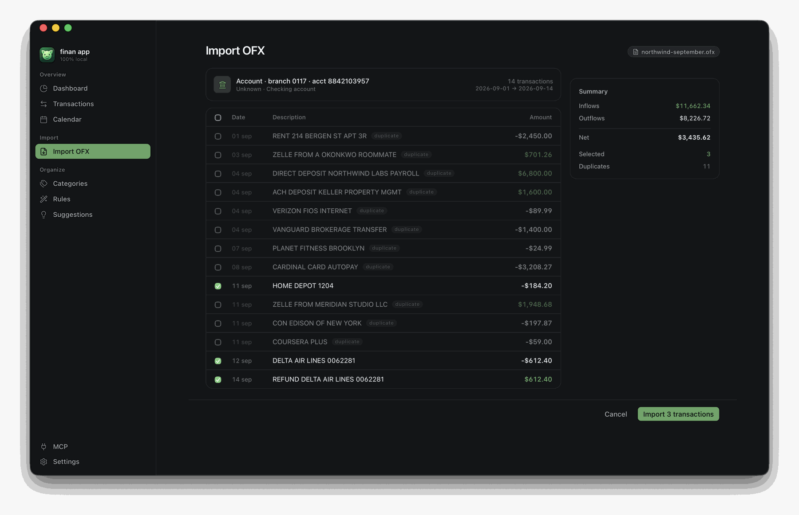
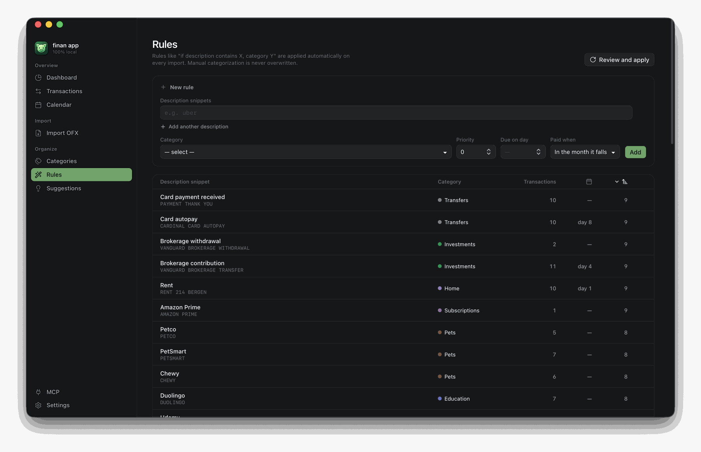
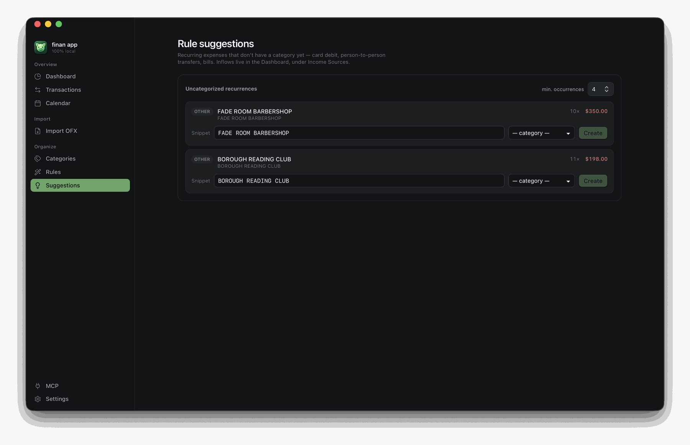
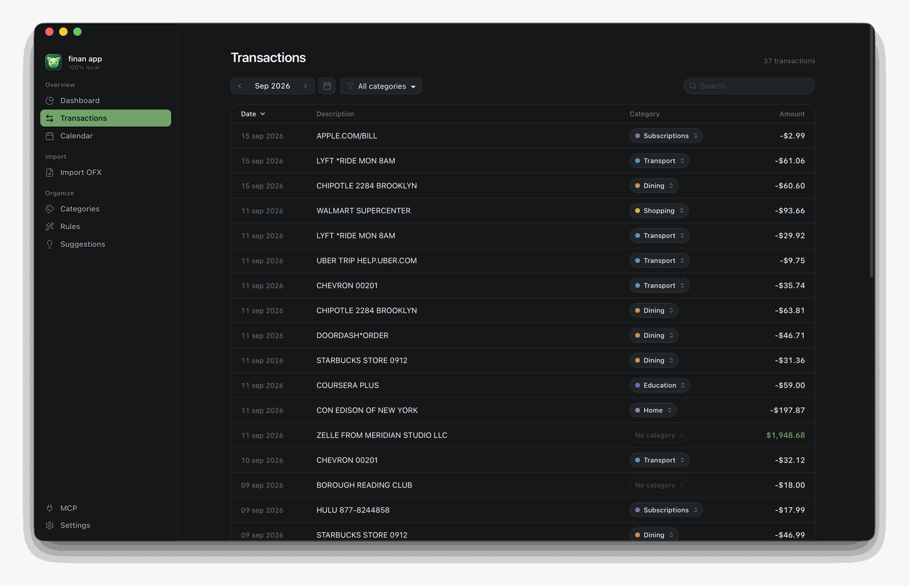
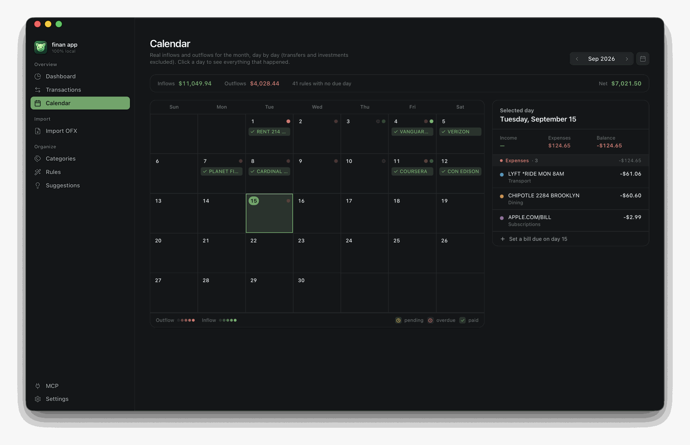
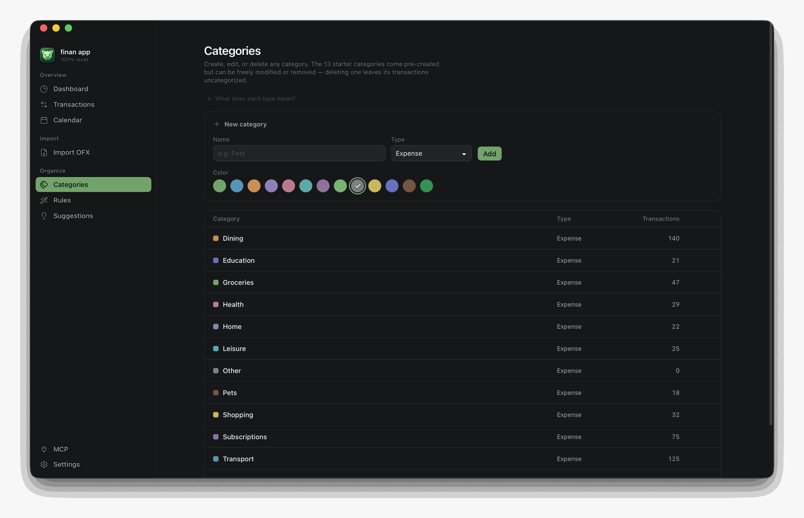
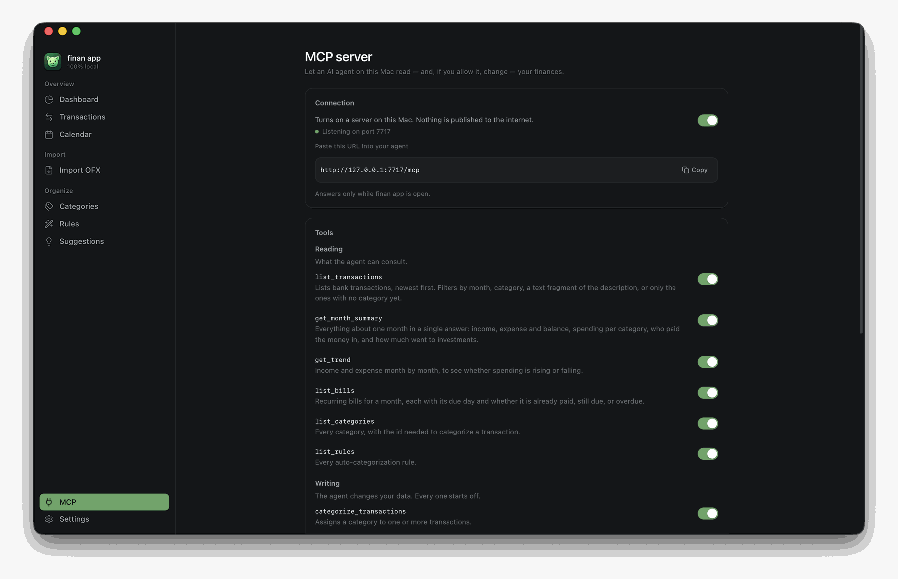

<div align="center">

<sub><a href="README.pt-BR.md">🇧🇷 Leia em português</a></sub>


# finan app

### Your money. Your data too.

**Personal finance that never leaves your Mac.**
No cloud. No account. No telemetry. One SQLite file you own.

<br>

<div>
<a href="https://github.com/MateusFonseK/finan-app/releases/latest"></a>


</div>

<br>

<a href="#-install">Install</a> ·
<a href="#-what-it-does">What it does</a> ·
<a href="#-privacy--the-actual-claim">Privacy</a> ·
<a href="#-ask-an-ai-agent-about-your-money">MCP</a> ·
<a href="#-speak-your-language">Languages</a> ·
<a href="#-under-the-hood">Under the hood</a>

</div>

<br>

Export the `.ofx` statement your bank already offers, drop it in, and finan app does the
rest: it deduplicates what you already have, spots reversals, applies your rules, and lays
the month out on a dashboard that answers *where did the money go* without you building a
single spreadsheet formula.

Everything lives in one file on your Mac. You know exactly where it is, you can copy it
anywhere, and any SQLite client can open it.

<br>



<br>

## 📥 Install

1. Download the latest `.dmg` from **[Releases](https://github.com/MateusFonseK/finan-app/releases/latest)** — universal (Apple Silicon + Intel), macOS 12 or newer.
2. Open it and drag **finan app** into **Applications**.
3. **First launch.** The app is not signed with a paid Apple Developer certificate, so macOS blocks it once with *"Apple could not verify 'finan app' is free of malware…"*. Click **OK** — never *Move to Trash* — then run this in Terminal:

   ```sh
   xattr -dr com.apple.quarantine "/Applications/finan app.app"
   ```

   Open it normally from then on.

   <details>
   <summary>Prefer not to use the Terminal?</summary>

   **System Settings → Privacy & Security → Security → "Open Anyway"**. The button only
   appears right after you try to open the app, so try to open it first.
   </details>

> Your browser tags every download with a `quarantine` flag. Without Apple notarization —
> which needs a paid developer account — Gatekeeper asks for this one manual confirmation.
> The source is right here: audit it, or build it yourself in two commands.

<br>

## ✨ What it does

### Import a statement, review before anything is saved

Drag the `.ofx` in, open it with finan app from Finder, or point the app at a folder and
let it find new statements on its own. Nothing is written until you say so.

Re-importing an overlapping statement is safe and expected: every row you already have is
flagged **duplicate** and left unchecked, so only genuinely new transactions are selected.
Charges and their refunds are paired up and shown together.



### Rules that categorize for you

A rule is *"if the description contains X — or Y, or Z — file it under this category"*.
Rules run on every import, and manual categorization always wins over them. Give a rule a
due day and it also becomes a bill on the calendar.

The app ships with a full set of rules for your locale, so the very first import already
lands mostly categorized.



### It shows you which rules you're missing

finan app finds the recurring charges that landed with no category and pre-fills the
description snippet, ready to become a rule. **You pick the category** — the app points at
the pattern, it never guesses what it means. One dropdown, one click, and the rule applies
to the past occurrences as well as the next ones.



### A month you can actually read

Income, expenses, balance and transaction count. Spending by category. **Income sources**,
with the recurring ones flagged — so a client who quietly stopped paying is visible.
Investments tracked apart from spending, because moving money to a brokerage is not an
expense. Eleven months of trend to see whether things are drifting.

Transfers between your own accounts — paying a card bill, funding an investment — are
excluded from the totals, so the card statement and the checking statement never
double-count the same money.



### Bills on a calendar, not in your head

Every rule with a due day becomes a recurring bill. The calendar shows what is paid, what
is pending, and what is overdue, and lets you settle an occurrence against the exact
transaction that paid it — or mark it paid outside the statement, in cash.



### Categories that bend to you

Thirteen come pre-made, and every category has a **type** — that is what decides how it
enters the maths:

| Type | What it is | What it does to the numbers |
|---|---|---|
| **Expense** | What you spend | Adds to Expenses, shows up in the category donut, pulls the month's balance down |
| **Income** | What you receive | Adds to Income, pushes the month's balance up |
| **Transfer** | Money merely moving: a card bill, a move between your own accounts, a contribution to a brokerage | **Excluded from everything** — income, expenses and balance |

That third type exists to kill the most common distortion for anyone tracking a checking
account and a card in one place: the bill payment leaves the checking account looking like
an expense, while that card's purchases were already counted one by one — the month doubles.
Marked as a transfer, the payment drops out of the totals and only the purchases count.

**Investments** is a transfer with its own treatment: it gets a dedicated dashboard panel
with contributed, redeemed and invested balance for the month — because moving money to a
brokerage is not spending, but it is not something you want out of sight either. That
treatment is marked in the locale pack; every other transfer simply stays out of the way.

Rename them, recolor them, change their type, delete the ones you don't want, add your own.
Deleting a category leaves its transactions intact and uncategorized — nothing is lost.



<br>

## 🔒 Privacy — the actual claim

No account. No login. No telemetry. No ads. No analytics SDK. Everything lives in
`~/Library/Application Support/app.finan/finan.db`, and **Settings → Open in Finder** takes
you straight to it. Back it up, copy it to another Mac, open it with any SQLite client. It
is yours.

Specific about the network, because "local-first" is a word people abuse:

| | Network request? |
|---|---|
| Launching, importing, categorizing, browsing, backing up | **Never** |
| **en-US** pack active | **Never — the pack declares no lookup provider at all** |
| **pt-BR** pack, tax-id lookup **off** (the default) | **Never** |
| **pt-BR** pack, tax-id lookup **on** (you turn it on) | Sends only the **CNPJ digits** — public registry data — to [BrasilAPI](https://brasilapi.com.br), to resolve a company name and suggest a category. Never amounts, never descriptions, never anything personal. |
| MCP server **on** | The server itself still dials out **never**. It listens. See below. |

<br>

## 🔌 Ask an AI agent about your money

Turn on the **MCP server** and an AI agent running on this same Mac can query your finances
in plain language — *how much did I spend on dining last month, and is it going up?*

It binds to `127.0.0.1` only. A cloud-hosted agent cannot reach it; the port is not on the
network. There is no token, because there is no remote surface to protect: the server
refuses any request carrying a web `Origin`, which is what stops a page open in your
browser from talking to it.



You choose every tool, one switch at a time. The six **read** tools start on; the three
**write** tools start off:

| Read | Write |
|---|---|
| `list_transactions` · `get_month_summary` · `get_trend` | `categorize_transactions` |
| `list_bills` · `list_categories` · `list_rules` | `create_rule` · `settle_bill` |

You also choose how far back the agent can see, and every call it makes is listed on screen
while the app is open.

Be clear-eyed about the trade, though. **The server sends nothing anywhere — but the agent
you connect does.** Whatever it reads, it forwards to its own provider. That is the deal,
and it is yours to make; that is exactly why this ships off, why writing starts off, and
why you pick the tools one by one.

<br>

## 🌍 Speak your language

The interface, the starting categories and the auto-classification rules all live in
[locale packs](locales/README.md) — plain JSON folders, no code. Ships with **Português
(Brasil)** and **English (US)**.

A pack is not a translation file. It carries the currency, the date format, the first day of
the week, the categories, the classification rules, and — where a country has one — the
tax-id format and the registry to resolve it against. Adding a country means copying a
folder and translating JSON. Pull requests welcome.

<br>

## 🪶 Why it's this small

**~20 MB installed.** No Electron, no bundled Chromium: the interface
is [Svelte 5](https://svelte.dev) running in the WebKit view macOS already ships, and
everything underneath is Rust. Of those ~20 MB, 18 are the binary — and it is universal, so
that single file carries both Apple Silicon and Intel. The entire interface, both locale
packs and every icon add up to under 200 KB: 55 hand-picked icons embedded as data rather
than a library of ~1,500.

<br>

## 🧱 Under the hood

[Tauri 2](https://tauri.app) · [Svelte 5](https://svelte.dev) (runes) · Rust · SQLite via
`rusqlite`. No backend, no ORM, no state-management library.

<details>
<summary><b>How it fits together</b></summary>

<br>

```
┌─ Svelte 5 (webview) ────────────────────┐
│  routes/ · components/ · stores         │
│  lib/ofx/ — parse, normalize, dedupe    │  OFX is parsed in the
│  lib/api/ — typed wrappers              │  frontend; only rows
└───────────────┬─────────────────────────┘  reach Rust
                │  tauri-specta: Rust types generated into TypeScript,
                │  so a command signature cannot drift from its caller
┌───────────────┴─────────────────────────┐
│  Rust                                   │
│  commands/  — one module per feature    │
│  domain/    — Account, Rule, Summary…   │
│  db/        — 18 forward-only migrations│
│  locale/    — packs + a contract test   │
│  enrich/    — tax-id lookup (opt-in)    │
│  mcp/       — server, tools, audit log  │
└───────────────┬─────────────────────────┘
                │
        ~/Library/Application Support/app.finan/finan.db
```

A few decisions worth knowing about:

- **Money is `TEXT`, never a float.** Amounts are parsed into `Decimal`. A cent never
  evaporates into binary floating point.
- **Deduplication is `(account, FITID, date, amount)`, not the FITID alone.** Some banks
  reuse one FITID across genuinely different transactions — a purchase and its refund, a
  fee and its principal, instalments 3/12 and 4/12. Keying on FITID alone silently drops
  half of them.
- **Rules reference a category `key`, never its name.** That is what lets you rename
  "Groceries" without breaking classification, and what lets one rule set work in any
  language.
- **A contract test asserts no dead UI strings exist.** Every key in a locale pack must be
  reachable from code, or `cargo test` fails.
- **Migrations are forward-only and never seed rows.** A fresh database is seeded from the
  active locale pack instead, which is why the language you pick decides your categories.

</details>

### Build it yourself

Prerequisites: [Rust](https://rustup.rs), [Node 22+](https://nodejs.org),
[pnpm](https://pnpm.io).

```sh
pnpm install
pnpm tauri dev                                   # development

rustup target add aarch64-apple-darwin x86_64-apple-darwin
pnpm tauri build --target universal-apple-darwin # universal release
```

The `.app` and `.dmg` land in `src-tauri/target/universal-apple-darwin/release/bundle/`.

```sh
pnpm test        # frontend (vitest)
cargo test       # backend, from src-tauri/
```

<br>

## 🤝 Contributing

Commit format, how versions are computed and how releases ship: **[CONTRIBUTING.md](CONTRIBUTING.md)**.

Every contribution is welcome: a fix, an idea, an issue, documentation, code. If you want to
bring your country to the app, [locale packs](locales/README.md) are plain JSON and need no
code at all.

<br>

## 📄 License

[MIT](LICENSE) © 2026 Mateus Fonseca

<div align="center">
<br>
<sub>Made with care. 🌱</sub>
<br>
<sub>Screenshots use fictitious data.</sub>
</div>
