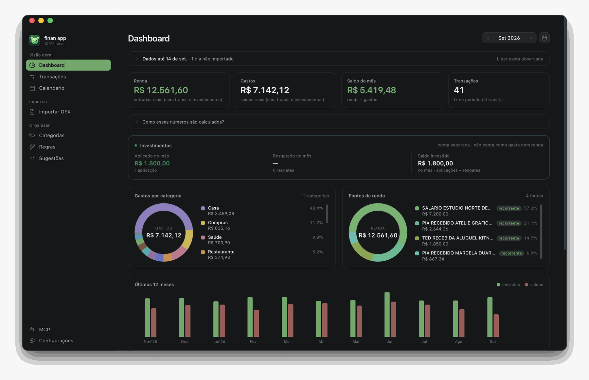
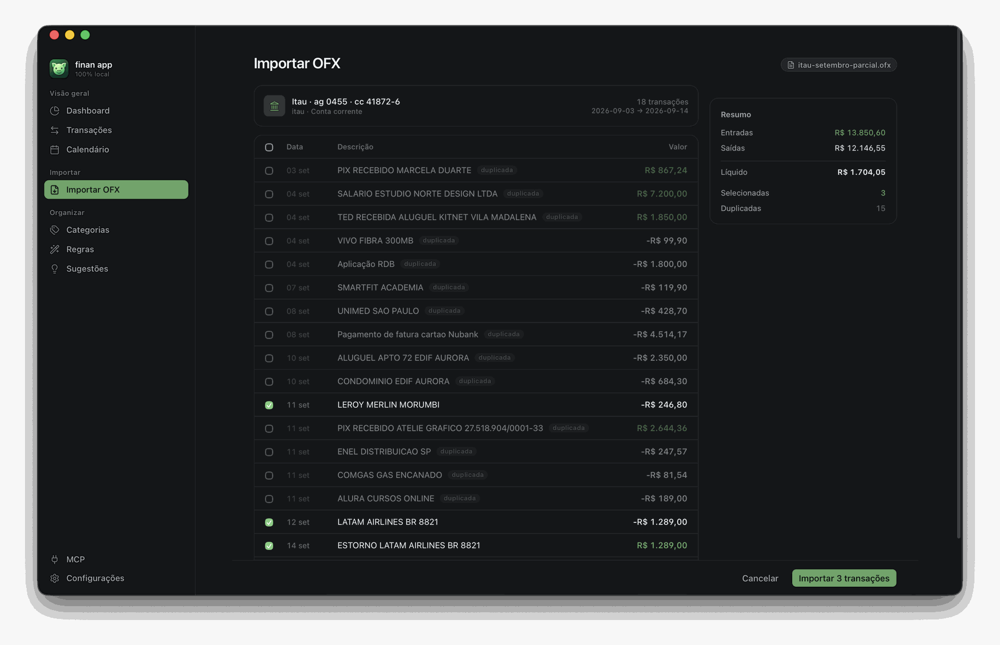
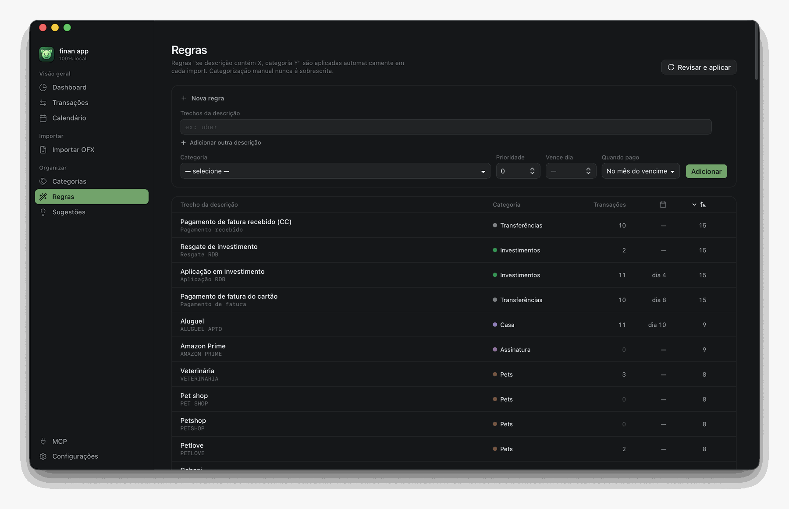
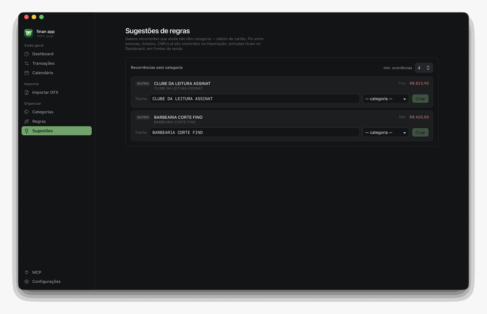
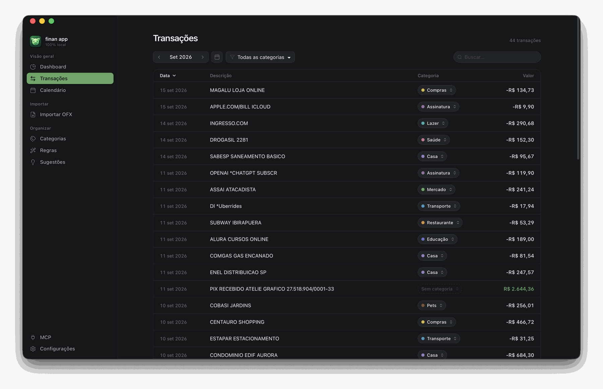
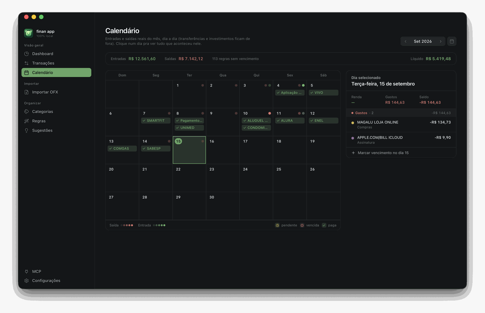
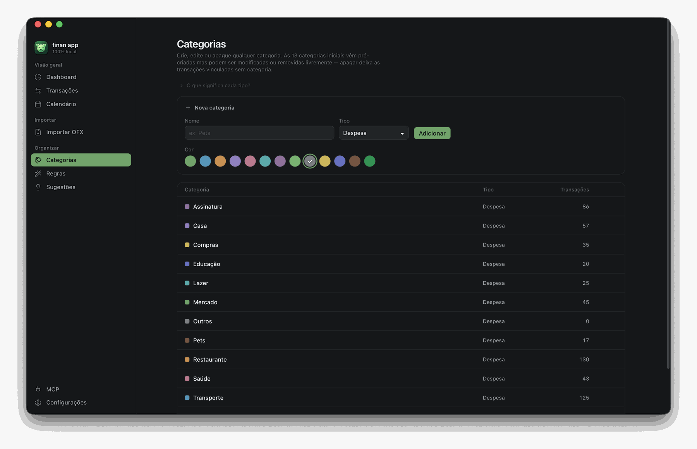
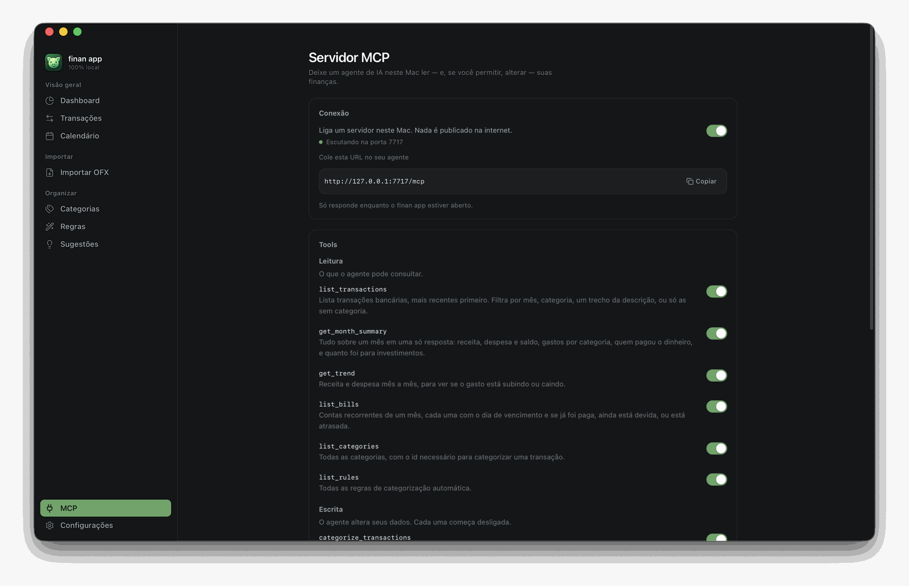

<div align="center">

<sub><a href="README.md">🇺🇸 Read in English</a></sub>


# finan app

### O dinheiro é seu. Os dados também.

**Finanças pessoais que nunca saem do seu Mac.**
Sem nuvem. Sem conta. Sem telemetria. Um arquivo SQLite que é seu.

<br>

<div>
<a href="https://github.com/MateusFonseK/finan-app/releases/latest"></a>


</div>

<br>

<a href="#-instalação">Instalação</a> ·
<a href="#-o-que-ele-faz">O que ele faz</a> ·
<a href="#-privacidade--a-afirmação-de-verdade">Privacidade</a> ·
<a href="#-pergunte-pra-uma-ia-sobre-seu-dinheiro">MCP</a> ·
<a href="#-fala-a-sua-língua">Idiomas</a> ·
<a href="#-por-dentro">Por dentro</a>

</div>

<br>

Exporte o extrato `.ofx` que seu banco já oferece, solte no app, e o finan app faz o resto:
descarta o que você já tem, identifica estornos, aplica suas regras e monta o mês num painel
que responde *pra onde foi o dinheiro* sem você escrever uma fórmula de planilha.

Tudo fica num arquivo só, no seu Mac. Você sabe exatamente onde ele está, pode copiar pra
onde quiser e abrir com qualquer cliente SQLite.

<br>



<br>

## 📥 Instalação

1. Baixe o `.dmg` mais recente em **[Releases](https://github.com/MateusFonseK/finan-app/releases/latest)** — universal (Apple Silicon + Intel), macOS 12 ou superior.
2. Abra e arraste o **finan app** pra pasta **Aplicativos**.
3. **Primeira abertura.** O app não é assinado com certificado pago da Apple, então o macOS bloqueia uma vez com *"não foi possível verificar se o 'finan app' está livre de malware…"*. Clique em **OK** — nunca em *Mover pro Lixo* — e rode no Terminal:

   ```sh
   xattr -dr com.apple.quarantine "/Applications/finan app.app"
   ```

   Depois disso é só abrir normalmente.

   <details>
   <summary>Prefere não usar o Terminal?</summary>

   **Ajustes do Sistema → Privacidade e Segurança → Segurança → "Abrir Assim Mesmo"**. O
   botão só aparece logo depois de você tentar abrir o app, então tente abrir primeiro.
   </details>

> O navegador marca todo download com a flag `quarantine`. Sem a notarização da Apple — que
> exige conta paga de desenvolvedor — o Gatekeeper pede essa confirmação manual uma vez. O
> código está aqui: audite, ou builde você mesmo em dois comandos.

<br>

## ✨ O que ele faz

### Importe o extrato e revise antes de salvar qualquer coisa

Arraste o `.ofx`, abra com o finan app pelo Finder, ou aponte uma pasta e deixe o app achar
os extratos novos sozinho. Nada é gravado até você mandar.

Reimportar um extrato que se sobrepõe é seguro e esperado: toda linha que você já tem é
marcada como **duplicada** e fica desmarcada, então só o que é realmente novo vem
selecionado. Cobrança e estorno são pareados e mostrados juntos.



### Regras que categorizam por você

Uma regra é *"se a descrição contém X — ou Y, ou Z — joga nessa categoria"*. As regras rodam
em todo import, e categorização manual sempre ganha delas. Dê um dia de vencimento pra uma
regra e ela também vira uma conta no calendário.

O app já vem com um conjunto completo de regras do seu país, então o primeiro import já cai
quase todo categorizado.



### Ele te mostra quais regras estão faltando

O finan app encontra os gastos recorrentes que caíram sem categoria e deixa o trecho da
descrição já preenchido, pronto pra virar regra. **A categoria quem escolhe é você** — o app
aponta o padrão, não adivinha o significado. Um select, um clique, e a regra vale pras
ocorrências passadas e pras próximas.



### Um mês que dá pra ler

Renda, gastos, saldo e número de transações. Gastos por categoria. **Fontes de renda**, com
as recorrentes marcadas — dá pra ver o cliente que parou de pagar sem avisar. Investimentos
acompanhados à parte dos gastos, porque mandar dinheiro pra corretora não é despesa. Onze
meses de tendência pra perceber se a coisa está escorregando.

Transferências entre contas suas — pagar a fatura, aplicar num investimento — ficam fora dos
totais, então o extrato do cartão e o da conta corrente nunca contam o mesmo dinheiro duas
vezes.



### Contas no calendário, não na sua cabeça

Toda regra com dia de vencimento vira uma conta recorrente. O calendário mostra o que está
pago, o que está pendente e o que está vencido, e deixa você amarrar uma ocorrência à
transação exata que pagou ela — ou marcar como paga fora do extrato, em dinheiro.



### Categorias que se dobram a você

Treze já vêm prontas, e toda categoria tem um **tipo** — é ele que decide como ela entra nas
contas:

| Tipo | O que é | O que faz com os números |
|---|---|---|
| **Despesa** | O que você gasta | Soma em Gastos, aparece no donut por categoria e derruba o saldo do mês |
| **Receita** | O que você recebe | Soma em Renda e levanta o saldo do mês |
| **Transferência** | Dinheiro só mudando de lugar: fatura do cartão, entre contas suas, aporte em investimento | **Fica fora de tudo** — renda, gastos e saldo |

O terceiro tipo existe pra evitar a distorção mais comum de quem junta conta corrente e
cartão no mesmo lugar: o pagamento da fatura sai da corrente como se fosse gasto, enquanto
as compras daquele cartão já foram contadas uma por uma — o mês dobra de tamanho. Marcado
como transferência, o pagamento some dos totais e só as compras contam.

**Investimentos** é uma transferência com tratamento próprio: ganha painel separado no
dashboard, com aplicado no mês, resgatado e saldo — porque mandar dinheiro pra corretora não
é despesa, mas também não é algo que você queira perder de vista. Esse tratamento vem
marcado no pacote de idioma; as demais transferências apenas ficam de fora.

Renomeie, troque a cor, mude o tipo, apague as que não quer, crie as suas. Apagar uma
categoria deixa as transações dela intactas e sem categoria — nada se perde.



<br>

## 🔒 Privacidade — a afirmação de verdade

Sem conta. Sem login. Sem telemetria. Sem anúncio. Sem SDK de analytics. Tudo mora em
`~/Library/Application Support/app.finan/finan.db`, e **Configurações → Abrir no Finder** te
leva direto lá. Faça backup, copie pra outro Mac, abra com qualquer cliente SQLite. É seu.

Sendo específico sobre rede, porque "local-first" é palavra que muita gente usa mal:

| | Faz requisição de rede? |
|---|---|
| Abrir, importar, categorizar, navegar, fazer backup | **Nunca** |
| Pacote **en-US** ativo | **Nunca — o pacote não declara nenhum provedor de consulta** |
| Pacote **pt-BR**, consulta de CNPJ **desligada** (o padrão) | **Nunca** |
| Pacote **pt-BR**, consulta de CNPJ **ligada** (você que liga) | Manda só os **dígitos do CNPJ** — dado público de registro — pra [BrasilAPI](https://brasilapi.com.br), pra descobrir o nome da empresa e sugerir categoria. Nunca valores, nunca descrições, nunca nada pessoal. |
| Servidor MCP **ligado** | O servidor em si continua **nunca** discando pra fora. Ele escuta. Veja abaixo. |

<br>

## 🔌 Pergunte pra uma IA sobre seu dinheiro

Ligue o **servidor MCP** e um agente de IA rodando neste mesmo Mac passa a consultar suas
finanças em português — *quanto gastei com restaurante mês passado, e está subindo?*

Ele escuta só em `127.0.0.1`. Um agente hospedado na nuvem não alcança; a porta não está na
rede. Não existe token, porque não existe superfície remota a proteger: o servidor recusa
qualquer requisição que traga um `Origin` de web, que é o que impede uma página aberta no
seu navegador de conversar com ele.



Você escolhe cada tool, uma chave por vez. As seis de **leitura** começam ligadas; as três
de **escrita** começam desligadas:

| Leitura | Escrita |
|---|---|
| `list_transactions` · `get_month_summary` · `get_trend` | `categorize_transactions` |
| `list_bills` · `list_categories` · `list_rules` | `create_rule` · `settle_bill` |

Você também escolhe até quando o agente enxerga pra trás, e toda chamada que ele faz aparece
na tela enquanto o app está aberto.

Mas sem ilusão sobre a troca. **O servidor não manda nada pra lugar nenhum — o agente que
você conecta manda.** Tudo que ele ler, ele repassa pro provedor dele. O acordo é esse, e a
decisão é sua; é exatamente por isso que isso vem desligado, que escrita começa desligada, e
que você liga tool por tool.

<br>

## 🌍 Fala a sua língua

A interface, as categorias iniciais e as regras de classificação automática moram todas em
[pacotes de idioma](locales/README.md) — pastas de JSON puro, sem código. Já vem com
**Português (Brasil)** e **English (US)**.

Um pacote não é um arquivo de tradução. Ele carrega a moeda, o formato de data, o primeiro
dia da semana, as categorias, as regras de classificação e — onde o país tem um — o formato
do documento fiscal e o registro onde consultar. Adicionar um país é copiar uma pasta e
traduzir JSON. Pull requests são bem-vindos.

<br>

## 🪶 Por que ele é tão pequeno

**~20 MB instalado.** Sem Electron, sem Chromium embutido: a interface é
[Svelte 5](https://svelte.dev) rodando na WebKit que o macOS já tem, e tudo por baixo é
Rust. Dos ~20 MB instalados, 18 são o binário — e ele é universal, ou seja, carrega Apple
Silicon e Intel no mesmo arquivo. A interface inteira, os dois pacotes de idioma e todos os
ícones somam menos de 200 KB: são 55 ícones escolhidos a dedo e embutidos como dado, em vez
de uma biblioteca de ~1.500.

<br>

## 🧱 Por dentro

[Tauri 2](https://tauri.app) · [Svelte 5](https://svelte.dev) (runes) · Rust · SQLite via
`rusqlite`. Sem backend, sem ORM, sem biblioteca de gerenciamento de estado.

<details>
<summary><b>Como as peças se encaixam</b></summary>

<br>

```
┌─ Svelte 5 (webview) ────────────────────┐
│  routes/ · components/ · stores         │
│  lib/ofx/ — parse, normalização, dedupe │  o OFX é lido no
│  lib/api/ — wrappers tipados            │  frontend; só as linhas
└───────────────┬─────────────────────────┘  chegam no Rust
                │  tauri-specta: tipos do Rust gerados em TypeScript,
                │  então a assinatura de um command não desgarra de quem chama
┌───────────────┴─────────────────────────┐
│  Rust                                   │
│  commands/  — um módulo por feature     │
│  domain/    — Account, Rule, Summary…   │
│  db/        — 18 migrations só pra frente│
│  locale/    — pacotes + teste de contrato│
│  enrich/    — consulta de CNPJ (opt-in) │
│  mcp/       — servidor, tools, log      │
└───────────────┬─────────────────────────┘
                │
        ~/Library/Application Support/app.finan/finan.db
```

Algumas decisões que valem conhecer:

- **Dinheiro é `TEXT`, nunca float.** Os valores viram `Decimal` na leitura. Nenhum centavo
  evapora em ponto flutuante binário.
- **A deduplicação é `(conta, FITID, data, valor)`, não só o FITID.** Alguns bancos reusam
  um FITID em transações genuinamente diferentes — uma compra e o estorno dela, o IOF e o
  principal, as parcelas 3/12 e 4/12. Chavear só pelo FITID derruba metade delas em
  silêncio.
- **As regras apontam pra `key` da categoria, nunca pro nome.** É isso que deixa você
  renomear "Mercado" sem quebrar a classificação, e que faz um conjunto de regras funcionar
  em qualquer idioma.
- **Um teste de contrato garante que não existe string de UI morta.** Toda chave de um
  pacote de idioma precisa ser alcançável pelo código, ou o `cargo test` falha.
- **As migrations são só pra frente e nunca semeiam linhas.** Um banco novo é semeado a
  partir do pacote de idioma ativo — é por isso que o idioma que você escolhe decide as
  suas categorias.

</details>

### Builde você mesmo

Pré-requisitos: [Rust](https://rustup.rs), [Node 22+](https://nodejs.org),
[pnpm](https://pnpm.io).

```sh
pnpm install
pnpm tauri dev                                   # desenvolvimento

rustup target add aarch64-apple-darwin x86_64-apple-darwin
pnpm tauri build --target universal-apple-darwin # release universal
```

O `.app` e o `.dmg` saem em `src-tauri/target/universal-apple-darwin/release/bundle/`.

```sh
pnpm test        # frontend (vitest)
cargo test       # backend, dentro de src-tauri/
```

<br>

## 🤝 Contribuindo

Formato de commit, como a versão é calculada e como o release sai:
**[CONTRIBUTING.pt-BR.md](CONTRIBUTING.pt-BR.md)**.

Toda contribuição é bem-vinda: correção, ideia, issue, documentação, código. Se quiser
trazer o seu país pro app, os [pacotes de idioma](locales/README.md) são JSON puro e não
exigem tocar em código.

<br>

## 📄 Licença

[MIT](LICENSE) © 2026 Mateus Fonseca

<div align="center">
<br>
<sub>Feito com carinho. 🌱</sub>
<br>
<sub>As telas usam dados fictícios.</sub>
</div>
